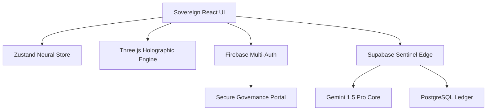

# ⬡ UNBIASED AI — Sovereign Neural Governance Engine
### Architect: [Krish Joshi](https://github.com/KR-007J) | Lead Partner: Gemini & Antigravity

[](https://unbiased-ai-krish-6789.web.app)
[](https://ai.google.dev)
[](LICENSE)

**Unbiased AI** is no longer just a tool; it is a **Sovereign Operating System for Information Governance**. Engineered for the Google Developer Hackathon 2024, this platform leverages the extreme multimodal power of Gemini 1.5 Pro to detect, forecast, and neutralize human bias across the digital landscape.

---

## 🏛️ Sovereign Vision
In an era of algorithmic manipulation and systemic polarization, **Unbiased AI** acts as the ultimate Neural Arbiter. It provides institutional-grade auditing, prophetic forecasting, and mathematical refraction to ensure that human communication remains objective, inclusive, and future-proof.

---

## 🚀 God Level Features

| Vector | Capability |
| :--- | :--- |
| 🔮 **Prophetic Vectoring** | 30-day bias forecasting and predictive slant analytics. |
| 🛡️ **Objective Refraction** | Mathematical neutralization of biased narratives in real-time. |
| 📑 **Institutional Export** | High-fidelity PDF audit reports with cryptographic neural signatures. |
| 🌐 **Sentinel Web Scan** | Multimodal URL auditing for live news and social infrastructure. |
| 🧠 **Sovereign Arbiter** | Advanced chat interface specialized in neural ethics and information governance. |
| 🧪 **Differential Audit** | Side-by-side holographic comparison of competing information streams. |

---

## 🏗️ Technical Architecture



### The God Stack
- **Architecture**: Micro-Frontend + Sovereign Edge Functions
- **Intelligence**: Google Gemini 1.5 Pro (Multimodal)
- **Design**: Cyber-Noir Glassmorphism with Fragmented Neural Transitions
- **Deployment**: Firebase Sovereign Hosting + Supabase Edge Grid

---

## 🛠️ Deployment & Orchestration

### Environment Synthesis
Ensure your `.env` contains the required Sovereign Keys:
- `VITE_FIREBASE_API_KEY`
- `VITE_SUPABASE_URL`
- `VITE_SUPABASE_ANON_KEY`
- `GEMINI_API_KEY` (Supabase Secret)

### Local Launch
```bash
git clone https://github.com/KR-007J/unbiased-ai.git
cd unbiased-ai/frontend
npm install
npm run dev
```

---

## 🏆 Hackathon Objective
This platform is the definitive submission for the **Google Developer Hackathon 2024**. It demonstrates how AI can move beyond simple generation into the realm of **Universal Governance and Objectivity**.

---

## 📄 License & Credits
- **License**: [Apache License 2.0](LICENSE)
- **Lead Architect**: **Krish Joshi**
- **Neural Partners**: **Gemini 1.5 Pro** & **Antigravity AI**

---

*“Neutrality is not a state of being; it is a vector of intelligence.”*
