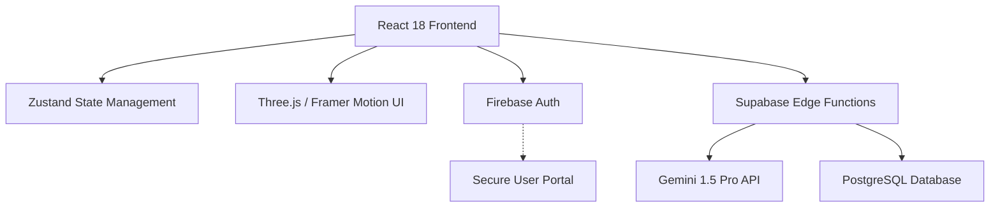

# ⬡ UNBIASED AI — Neural Bias Analysis System
### Google Developer Hackathon 2024 Showcase

[](https://unbiased-ai-krish-6789.web.app)
[](https://fslkykyavvtoxnnwubdp.supabase.co)
[](https://ai.google.dev)

A next-generation, enterprise-grade bias detection and analysis platform powered by **Gemini 1.5 Pro**. Built with a living, breathing **3D Futuristic UI**, this system detects, visualizes, and helps eliminate bias in text with real-time neural scanning.

---

## 🌟 Vision
In an era of rapid information sharing, hidden biases can distort truth and perpetuate inequality. **Unbiased AI** serves as a neural lens, allowing researchers, editors, and students to identify prejudices across 10+ categories and transform them into neutral, evidence-based communication.

---

## 🚀 Key Features

| Feature | Description |
|---|---|
| 🔍 **Multi-Bias Detection** | Real-time scanning for Gender, Racial, Political, Age, Cultural, and Socioeconomic bias. |
| 🎯 **Neural Rewrite Engine** | Generates unbiased versions of text while strictly preserving original intent and nuance. |
| 📊 **Interactive Analytics** | Animated gauge meters and holographic charts showing bias intensity and confidence. |
| ⟺ **Differential Comparison** | Side-by-side analysis of two documents with holographic bias overlays. |
| ◎ **Fairness Chat** | Converational AI assistant specialized in inclusion and neutral communication. |
| 💾 **Cloud-Native Audit Trail** | Full analysis history stored in Supabase with sub-2s latency. |

---

## 🏗️ Technical Architecture



### Stack
- **Core**: React 18, TypeScript, Vite
- **3D/UI**: Three.js, React Three Fiber, Framer Motion
- **Auth**: Firebase Authentication (Google OAuth)
- **Backend**: Supabase Edge Functions (Deno)
- **Intelligence**: Google Gemini 1.5 Pro
- **Storage**: Supabase PostgreSQL

---

## 🛠️ Installation & Setup

### Prerequisites
- Node.js 18+
- [Gemini API Key](https://aistudio.google.com/)

### Local Start
```bash
# Clone the repository
git clone https://github.com/KR-007J/unbiased-ai.git

# Navigate to frontend
cd unbiased-ai/frontend

# Install dependencies
npm install

# Connect Environment
cp .env.example .env
# Fill in your Firebase & Supabase keys

# Launch System
npm start
```

---

## 🎨 Creative Design System
The UI implementation follows a **Cyber Noir** aesthetic:
- **Typography**: Rajdhani (Display), Share Tech Mono (Code)
- **Effects**: Glassmorphism, Particle Fields, Holographic Shaders
- **Palette**: Void Black (#050505), Neural Cyan (#00f2ff), Bio-Purple (#bc00ff)

---

## 🏆 Hackathon
This project was developed for the **Google Developer Hackathon 2024**, demonstrating the practical application of Large Language Models for social equity and data integrity.

---

## 📄 License
This project is licensed under the **Apache License 2.0**. See the [LICENSE](LICENSE) file for details.

---

Built with ❤️ for a fairer future.
