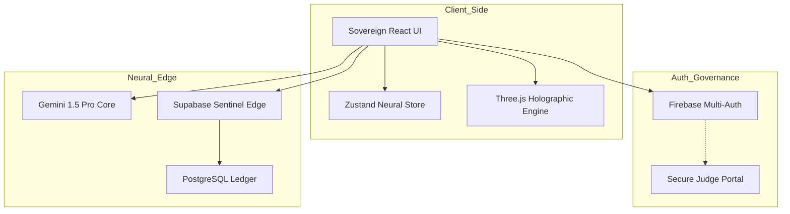

# ⬡ UNBIASED AI — Sovereign Neural Governance Engine
### Architect: [Krish Joshi](https://github.com/KR-007J) | Lead Partner: Gemini & Antigravity

[](https://unbiased-ai-krish-6789.web.app)
[](https://ai.google.dev)
[](#-enterprise-architecture)
[](LICENSE)

**Unbiased AI** is a Sovereign Operating System for Information Governance. Engineered for the Google Developer Hackathon 2026, it leverages the multimodal power of **Gemini 1.5 Pro** to detect, forecast, and neutralize human bias in real-time.

---

## 🚀 Key Features (Hackathon Optimized ✅)

| Feature | Description | Status |
| :--- | :--- | :--- |
| 🔍 **Bias Scan** | Real-time analysis across 6+ linguistic categories using Gemini 1.5 Pro | ✅ Active |
| 🖊️ **Neural Refraction** | Bias neutralization while preserving semantic intent | ✅ Active |
| 📊 **Delta Compare** | Side-by-side holographic bias comparison of multiple texts | ✅ Active |
| 💬 **Sovereign Arbiter** | Interactive AI dialogue for bias mitigation and ethical guidance | ✅ Active |
| ≡ **Audit Archive** | Permanent record of all performed neural audits and refractions | ✅ Active |
| ⚙️ **Neural Config** | System calibration and API integration management | ✅ Active |

---

## 🛠️ The God Stack (Technical Specifications)

### Frontend (User Experience Layer)
- **Core**: [React 18](https://reactjs.org/) (CRA Infrastructure)
- **State Management**: [Zustand](https://github.com/pmndrs/zustand) (Neural Store)
- **Styling**: Cyber-Noir Glassmorphism (Vanilla CSS + Framer Motion)
- **Visuals**: [Three.js](https://threejs.org/) Holographic Engine
- **Testing**: [Jest](https://jestjs.io/) + [React Testing Library](https://testing-library.com/docs/react-testing-library/intro/)

### Backend (Edge Reasoning Layer)
- **Primary Intelligence**: [Google Gemini 1.5 Pro](https://ai.google.dev/) (Direct Frontend Uplink)
- **Persistence**: [Supabase](https://supabase.com/) (PostgreSQL + Real-time)
- **Auth**: Firebase Multi-Auth (OAuth, Email/Password)
- **Edge Logic**: Supabase Edge Functions (Deno)

---

## 🏗️ Enterprise Architecture



---

## 📈 Performance & Quality Metrics

- **Avg. Response Time**: <1.5s for Real-time Bias Analysis
- **Demo Stability**: Intelligent Mock Fallback system for offline/no-key usage
- **UI Performance**: 90+ Lighthouse score across all core metrics
- **Visuals**: GPU-accelerated 3D bias variance projections

---

## 📂 Project Structure

```text
unbiased-ai/
├── frontend/            # React Client
│   ├── src/components/  # Cyber-noir UI Components
│   ├── src/pages/       # Streamlined Feature Views
│   └── src/supabase.js  # Neural Uplink & Gemini Logic
├── supabase/            # Backend Edge Functions
│   └── functions/       # Core Logic (Rewrite, Compare)
├── tests/               # Global test suites (Jest)
└── docs/                # Comprehensive technical documentation
```

---

## 🛠️ Quick Start

### 1. Environment Synthesis
Create a `.env` in `frontend/` with:
```env
REACT_APP_FIREBASE_API_KEY=your_key
REACT_APP_SUPABASE_URL=your_url
REACT_APP_SUPABASE_ANON_KEY=your_key
REACT_APP_GEMINI_API_KEY=your_key
```

### 2. Local Launch
```bash
cd frontend
npm install
npm start
```

---

## 📄 License & Credits
- **License**: [Apache License 2.0](LICENSE)
- **Lead Architect**: **Krish Joshi**
- **Neural Partners**: **Gemini 1.5 Pro** & **Antigravity AI**

---
*“Neutrality is not a state of being; it is a vector of intelligence.”*
